# HiX source tables

This page documents all 13 HiX source tables that are ingested into the OMOP pipeline. For each table the diagram shows how raw HiX columns (left subgraph) are renamed and cleaned in the corresponding dbt staging model (right subgraph). Arrows connect each source column to its alias; columns prefixed with `~` have no source column and are derived or set to `null` in staging.

The staging models live in `dbt/models/staging/hix/`. Each model follows the two-CTE pattern described in [Add a staging model](../how-to/staging-model.md).

---

## Admissions

Source table: `opname_opname`

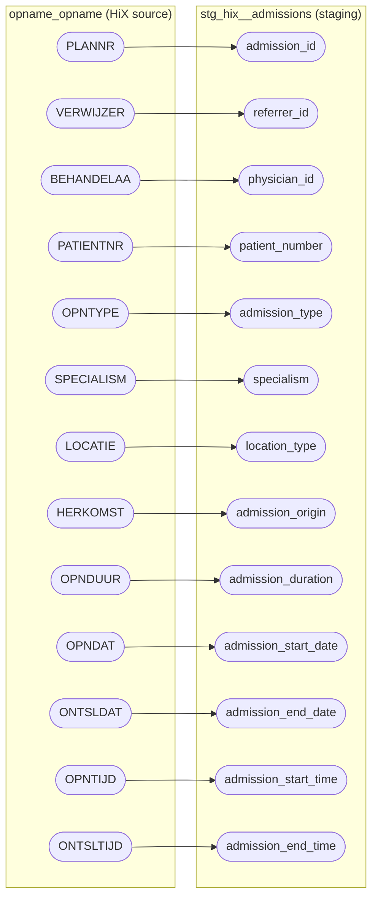

---

## Admission Origins

Source table: `opname_herkomst`

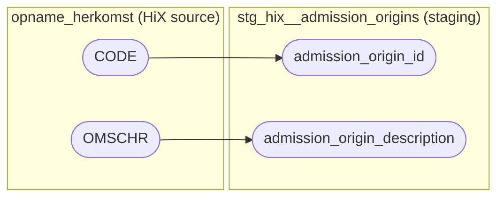

---

## Admission Types

Source table: `opname_opntype1`

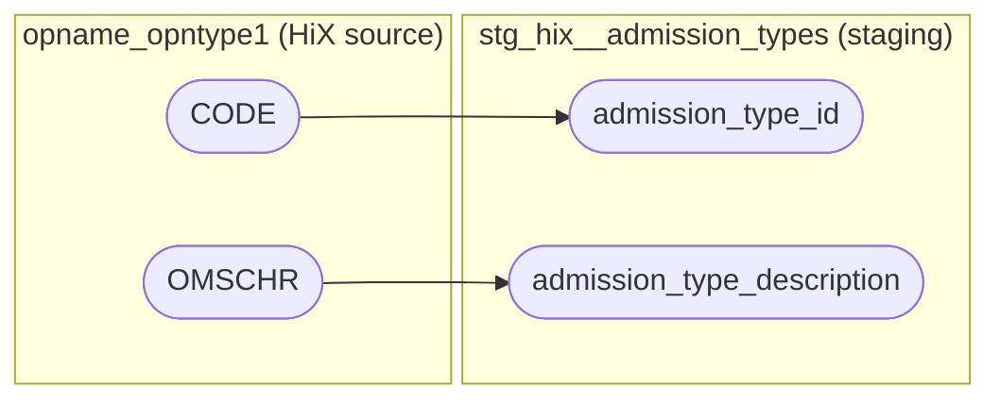

---

## Consults

Source table: `consult_regpart`

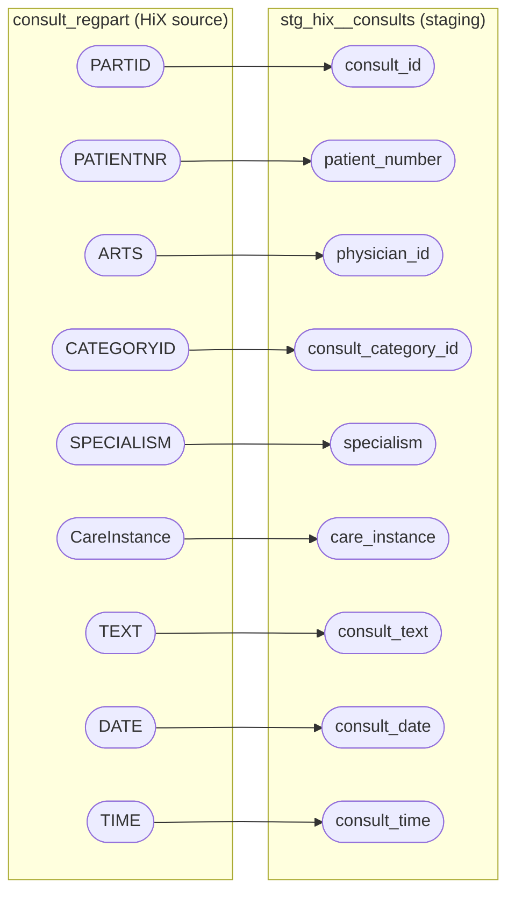

---

## Consult Categories

Source table: `consult_category`

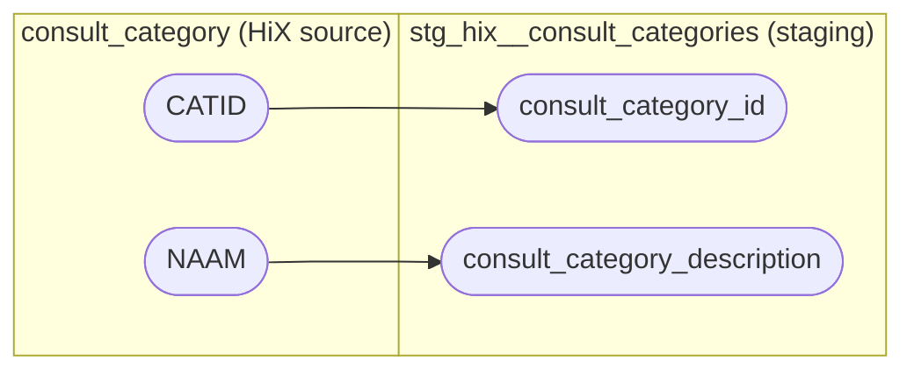

---

## Diagnose Code

Source table: `episode_diag`

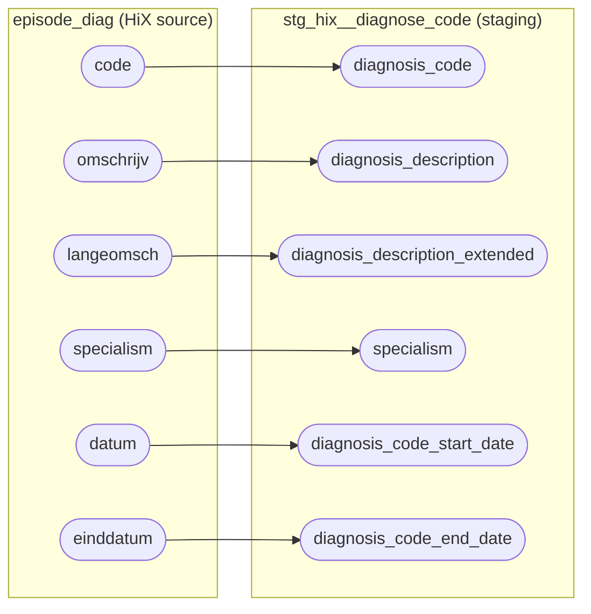

---

## Diagnoses and Treatments

Source table: `episode_dbcper`

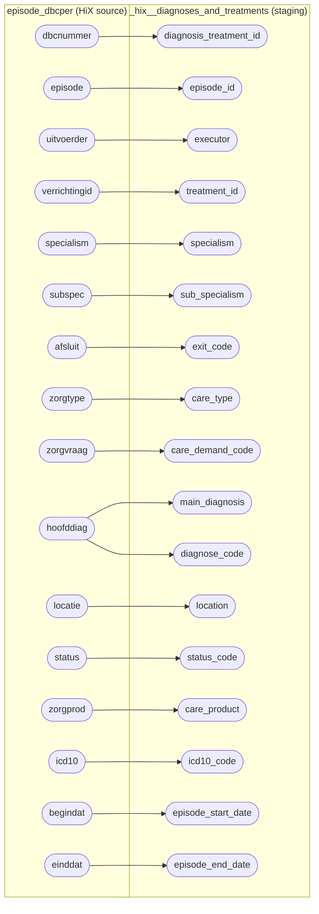

---

## Episodes

Source table: `episode_episode`

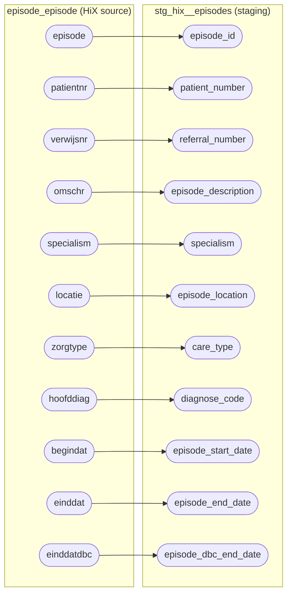

---

## Lab Requests

Source table: `lab_l_aanvrg`

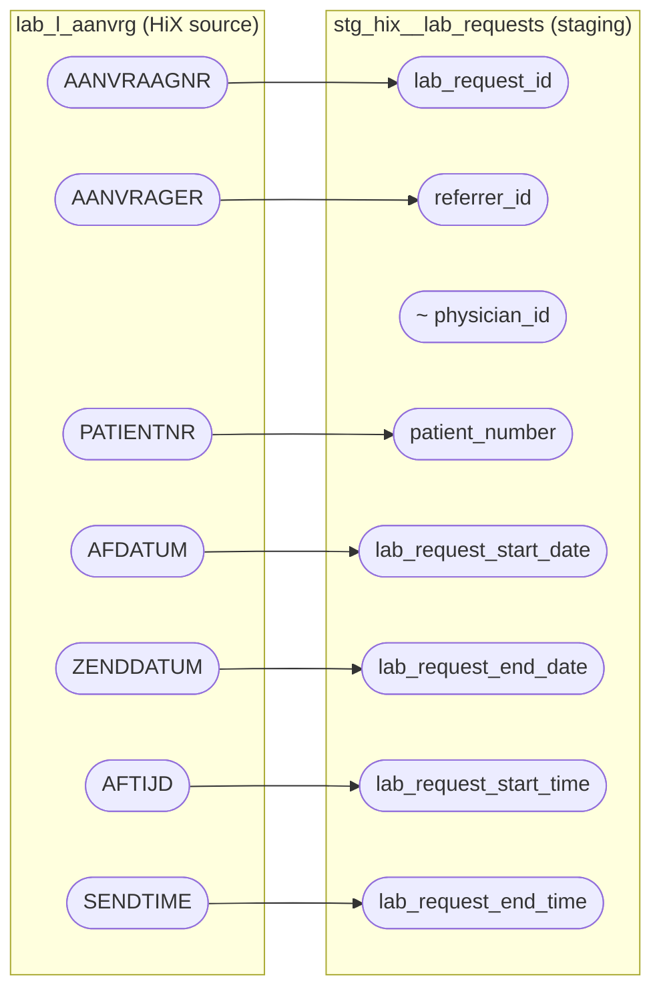

---

## Medication

Source table: `medicat_recdeel`

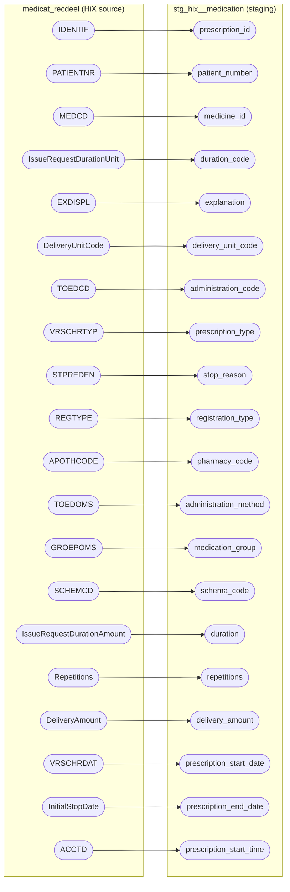

---

## Medicines

Source table: `medicat_medicijn`

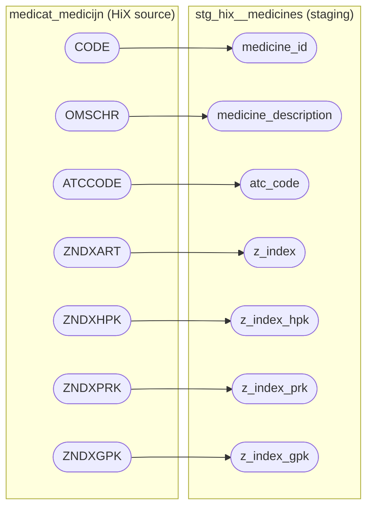

---

## Patients

Source table: `patient_patient`

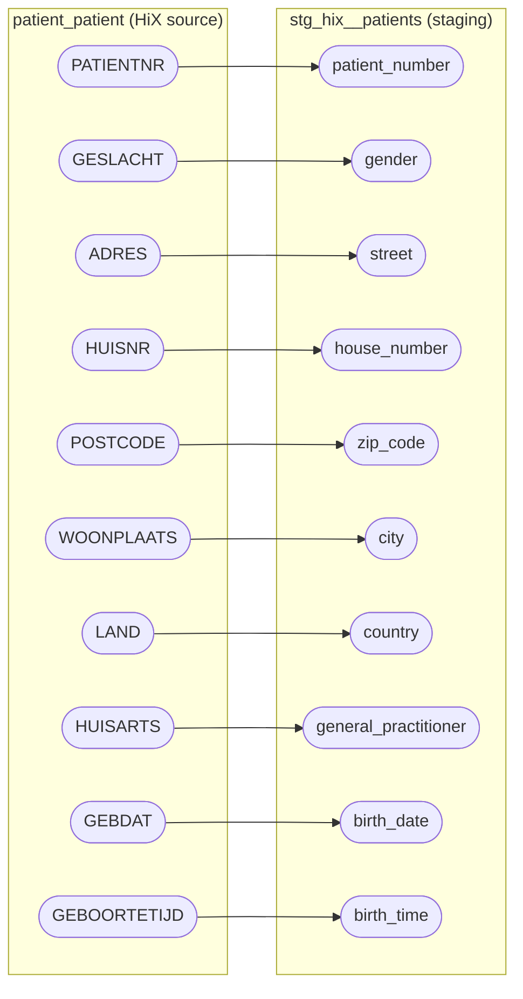

---

## Units

Source table: `medicat_eenheid`

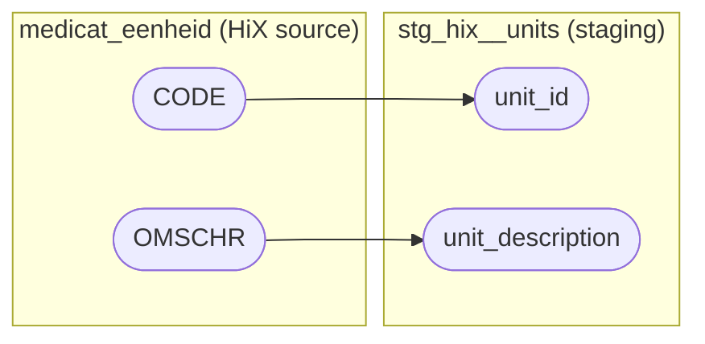
